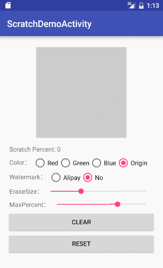

# ScratchView

This is a android custom view , like a scratch card effect!

## Last Update

- 采纳[DearZack童鞋的优化思路](https://github.com/D-clock/ScratchView/issues/3)，把计算擦除面积比例的操作放在手指离开屏幕时，以降低对CPU的占用。

## Articles

- [ScratchView：一步步打造万能的 Android 刮奖效果控件](http://www.jianshu.com/p/2514a08d8217)

## Demo screen

 

## Import

Gradle

```

dependencies {
    compile 'com.clock.scratch:Scratch:1.0.0'
}

```

Maven

```

<dependency>
  <groupId>com.clock.scratch</groupId>
  <artifactId>Scratch</artifactId>
  <version>1.0.0</version>
  <type>pom</type>
</dependency>

```

## How to use

- Create a contains of content view and ScratchView FrameLayout，let ScratchView displayed in the top.

```xml

	 <FrameLayout
        android:layout_width="200dp"
        android:layout_height="200dp"
        android:layout_gravity="center_horizontal"
        android:layout_marginTop="8dp">

		<!-- content view -->
        <ImageView
            android:layout_width="150dp"
            android:layout_height="150dp"
            android:layout_gravity="center"
            android:src="@mipmap/lufy" />

		<!-- scratch view -->
        <com.clock.scratch.ScratchView
            android:id="@+id/scratch_view"
            android:layout_width="match_parent"
            android:layout_height="match_parent" />
    </FrameLayout>

```

- Key Properties and Java API

| Properties | Java API |
|------------|----------|
| scratch:maskColor | setMaskColor(int color) |
| scratch:watermark | setWatermark(int resId) |
| scratch:eraseSize | setEraserSize(float eraserSize) |
| scratch:maxPercent | setMaxPercent(int max) |

More use , you need see the demo code...

## License

    Copyright 2016 D_clock爱吃葱花
    
    Licensed under the Apache License, Version 2.0 (the "License");
    you may not use this file except in compliance with the License.
    You may obtain a copy of the License at
    
        http://www.apache.org/licenses/LICENSE-2.0
    
    Unless required by applicable law or agreed to in writing, software
    distributed under the License is distributed on an "AS IS" BASIS,
    WITHOUT WARRANTIES OR CONDITIONS OF ANY KIND, either express or implied.
    See the License for the specific language governing permissions and
    limitations under the License.